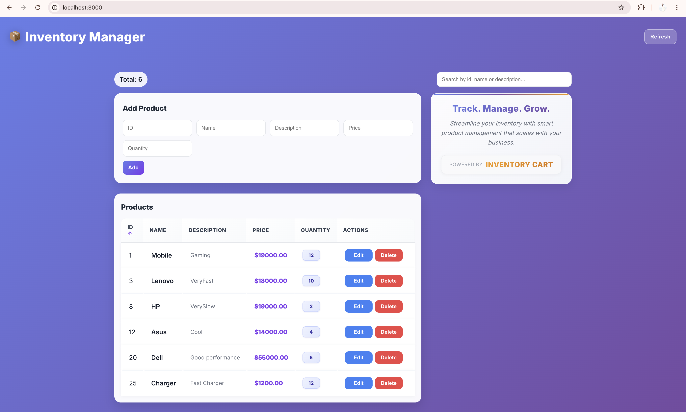
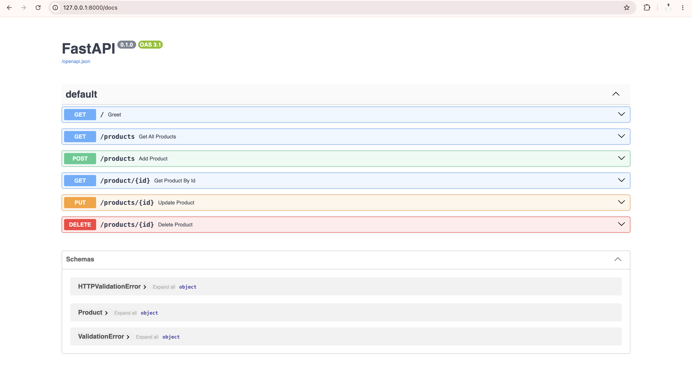

# FastAPI Product Management Project

## Screenshots





# FastAPI Product Management Task


## 1. Project Architecture

### Local Development

```text
Browser
   |
   v
React Frontend :3000
   |
   | HTTP / Axios
   v
FastAPI :8000
   |
   v
SQLAlchemy
   |
   v
MySQL
```

### Kubernetes Deployment

```text
                         Client
                           |
                           v
                  NGINX Ingress Controller
                           |
                           v
                  Ingress: fastapi.local
                           |
                           v
              ClusterIP Service :8000
                           |
                +----------+----------+
                |                     |
                v                     v
        FastAPI Pod             FastAPI Pod
        Worker Node             Worker Node
                |                     |
                +----------+----------+
                           |
                           v
                    MySQL Service
                           |
                           v
                     MySQL Pod
                    StatefulSet
                           |
                           v
                     MySQL PVC
                           |
                           v
                     MySQL PV
                  /data/mysql
```

### Application Flow

```text
Client
  ↓
NGINX Ingress
  ↓
FastAPI ClusterIP Service
  ↓
FastAPI Pods
  ↓
MySQL ClusterIP Service
  ↓
MySQL StatefulSet
  ↓
Persistent Volume
```

---

# 2. Technologies

| Technology    | Purpose                          |
| ------------- | -------------------------------- |
| Python        | Backend programming              |
| FastAPI       | REST API                         |
| Uvicorn       | ASGI application server          |
| Pydantic      | Request/response validation      |
| SQLAlchemy    | Database ORM                     |
| PyMySQL       | MySQL connectivity               |
| MySQL         | Application database             |
| React         | Frontend                         |
| Axios         | API communication                |
| Docker        | Containerization                 |
| Kubernetes    | Container orchestration          |
| Helm          | Kubernetes application packaging |
| NGINX Ingress | External HTTP routing            |
| Git / GitHub  | Source control                   |

---

# 3. Repository Structure

```text
Fast_API-Project/
│
├── frontend/
│   ├── main.py
│   ├── models.py
│   ├── database.py
│   └── database_models.py
│
├── Practice/
│
├── kubernetes/
│   ├── mysql/
│   │   ├── pv.yaml
│   │   ├── pvc.yaml
│   │   ├── service.yaml
│   │   └── statefulset.yaml
│   │
│   └── fastapi/
│       └── deployment.yaml
│
├── helm/
│   └── fastapi/
│       ├── Chart.yaml
│       ├── values.yaml
│       ├── .helmignore
│       │
│       └── templates/
│           ├── _helpers.tpl
│           ├── deployment.yaml
│           ├── hpa.yaml
│           ├── ingress.yaml
│           ├── service.yaml
│           └── tests/
│               └── test-connection.yaml
│
├── Dockerfile
├── .dockerignore
├── .gitignore
├── requirements.txt
├── package-lock.json
└── README.md
```

---

# 4. FastAPI Application

The backend provides CRUD APIs for managing products.

### API Endpoints

| Method | Endpoint         | Purpose          |
| ------ | ---------------- | ---------------- |
| GET    | `/products`      | Get all products |
| GET    | `/product/{id}`  | Get a product    |
| POST   | `/products`      | Create a product |
| PUT    | `/products/{id}` | Update a product |
| DELETE | `/products/{id}` | Delete a product |

FastAPI automatically provides Swagger documentation at:

```text
http://127.0.0.1:8000/docs
```

---

# 5. Database

The application uses **MySQL** with SQLAlchemy.

```text
FastAPI
   ↓
SQLAlchemy
   ↓
PyMySQL
   ↓
MySQL
   ↓
product table
```

Database configuration is supplied through environment variables.

The Kubernetes deployment uses a Kubernetes Secret for database credentials.

**Database passwords and actual Secret values are not committed to GitHub.**

---

# 6. Docker

The FastAPI application is packaged into a Docker image.

### Dockerfile

The image:

1. Uses Python 3.14
2. Creates `/app` as the working directory
3. Installs Python dependencies
4. Copies the FastAPI application
5. Exposes port `8000`
6. Starts Uvicorn

### Build Image

```bash
docker build -t fastapi-app:latest .
```

### Run Container

```bash
docker run -p 8000:8000 fastapi-app:latest
```

### Docker Image

The application image is published as:

```text
iqlas22/fastapi-app
```

---

# 7. Kubernetes

The application is deployed into the Kubernetes namespace:

```text
api
```

### Main Kubernetes Components

```text
FastAPI
 ├── Deployment
 ├── Service
 ├── Ingress
 ├── HPA
 └── Health Probes

MySQL
 ├── StatefulSet
 ├── Service
 ├── PVC
 └── PV
```

---

# 8. MySQL Persistent Storage

MySQL uses persistent storage so that database data is not tied only to the lifecycle of the Pod.

```text
MySQL Pod
   ↓
PVC: mysql-pvc
   ↓
PV: mysql-pv
   ↓
/data/mysql
```

### Storage Configuration

| Resource       | Configuration |
| -------------- | ------------- |
| Storage        | 5Gi           |
| Access Mode    | ReadWriteOnce |
| Storage Class  | manual        |
| Reclaim Policy | Retain        |
| Storage Type   | Local         |
| Node           | worker-1      |

The PV uses node affinity so that the MySQL Pod runs on the node containing its local storage.

---

# 9. FastAPI Deployment

The original Kubernetes Deployment is maintained under:

```text
kubernetes/fastapi/deployment.yaml
```

The application image used by the raw Deployment is:

```text
iqlas22/fastapi-app:day2-v2
```

The Deployment connects to MySQL through the Kubernetes Service:

```text
DB_HOST=mysql
DB_PORT=3306
```

Kubernetes DNS resolves:

```text
mysql
```

to the MySQL Service.

The application therefore does not connect directly to the MySQL Pod IP.

---

# 10. Helm Deployment

The FastAPI application is currently managed using Helm.

Helm chart:

```text
helm/fastapi/
```

The chart contains:

```text
Chart.yaml
values.yaml
templates/
├── deployment.yaml
├── service.yaml
├── ingress.yaml
├── hpa.yaml
├── _helpers.tpl
└── tests/
```

### Why Helm?

Helm allows Kubernetes resources to be managed as a single application package.

Instead of manually maintaining multiple Kubernetes YAML files, configuration can be controlled through:

```text
values.yaml
```

and Kubernetes resources are generated from:

```text
templates/
```

---

# 11. Helm Configuration

Current important values:

```yaml
image:
  repository: iqlas22/fastapi-app
  tag: day2-v3

service:
  type: ClusterIP
  port: 8000
  targetPort: 8000

autoscaling:
  enabled: true
  minReplicas: 2
  maxReplicas: 10
  targetCPUUtilizationPercentage: 70
```

---

# 12. Helm Commands

### Validate Chart

```bash
helm lint ./helm/fastapi
```

### Preview Generated Kubernetes YAML

```bash
helm template fastapi-release ./helm/fastapi -n api
```

### Install

```bash
helm install fastapi-release ./helm/fastapi -n api
```

### Upgrade

```bash
helm upgrade fastapi-release ./helm/fastapi -n api
```

### Check Release

```bash
helm status fastapi-release -n api
```

### View History

```bash
helm history fastapi-release -n api
```

### Rollback

```bash
helm rollback fastapi-release <REVISION> -n api
```

---

# 13. Kubernetes Service

The FastAPI application uses a **ClusterIP Service**.

```yaml
service:
  type: ClusterIP
  port: 8000
  targetPort: 8000
```

The Service provides a stable internal endpoint for the FastAPI Pods.

```text
Ingress
   ↓
FastAPI ClusterIP Service
   ↓
FastAPI Pods
```

The Service automatically distributes traffic between the available FastAPI Pods.

---

# 14. Ingress

The application is exposed through an NGINX Ingress.

Host:

```text
fastapi.local
```

Traffic flow:

```text
Client
   ↓
NGINX Ingress
   ↓
fastapi.local
   ↓
FastAPI ClusterIP Service
   ↓
FastAPI Pods
```

Ingress provides HTTP routing without requiring the FastAPI Service itself to be exposed as a NodePort.

---

# 15. Health Probes

The FastAPI Deployment uses Kubernetes health probes.

### Liveness Probe

```yaml
livenessProbe:
  httpGet:
    path: /
    port: http
```

The liveness probe checks whether the application is still functioning.

If the container repeatedly fails its liveness check, Kubernetes can restart the container.

### Readiness Probe

```yaml
readinessProbe:
  httpGet:
    path: /
    port: http
```

The readiness probe checks whether the Pod is ready to receive traffic.

If readiness fails, Kubernetes removes the Pod from the Service's available endpoints until it becomes ready again.

### Verify Probes

```bash
kubectl describe deployment fastapi-release -n api
```

Or:

```bash
kubectl describe pod <pod-name> -n api
```

Check Kubernetes events with:

```bash
kubectl get events -n api
```

---

# 16. Horizontal Pod Autoscaler

The FastAPI application uses Kubernetes HPA.

Current configuration:

```text
Minimum replicas: 2
Maximum replicas: 10
CPU target: 70%
```

```text
                 HPA
                  |
          Monitors CPU usage
                  |
                  v
            Deployment
                  |
          Adjusts replicas
                  |
        +---------+---------+
        |         |         |
       Pod       Pod       Pod
```

Important:

> HPA does not directly create Pods. HPA changes the desired replica count of the Deployment, and the Deployment/ReplicaSet creates or removes Pods.

### Check HPA

```bash
kubectl get hpa -n api
```

Detailed information:

```bash
kubectl describe hpa fastapi-release -n api
```

---

# 17. Worker Node Scheduling

The FastAPI Pods are scheduled across available worker nodes by the Kubernetes scheduler.

Example:

```text
worker-1
 └── FastAPI Pod

worker-2
 └── available

worker-3
 └── FastAPI Pod

worker-4
 └── available
```

No specific worker node is required for FastAPI.

The Kubernetes scheduler selects an eligible node based on available resources and scheduling rules.

MySQL is different because its local PV has node affinity to `worker-1`.

---

# 18. Useful Verification Commands

### Check Nodes

```bash
kubectl get nodes -o wide
```

### Check All Application Resources

```bash
kubectl get all -n api
```

### Check Pods

```bash
kubectl get pods -n api -o wide
```

### Check Services

```bash
kubectl get svc -n api
```

### Check Ingress

```bash
kubectl get ingress -n api
```

### Check HPA

```bash
kubectl get hpa -n api
```

### Check Storage

```bash
kubectl get pv
kubectl get pvc -n api
```

### Check Helm

```bash
helm status fastapi-release -n api
```

---

# 19. Final Kubernetes Architecture

```text
                           Client
                             |
                             v
                  NGINX Ingress Controller
                             |
                             v
                    Ingress: fastapi.local
                             |
                             v
                FastAPI ClusterIP Service
                             |
                    +--------+--------+
                    |                 |
                    v                 v
              FastAPI Pod       FastAPI Pod
                    |                 |
                    +--------+--------+
                             |
                             v
                       MySQL Service
                             |
                             v
                       MySQL Pod
                     StatefulSet
                             |
                             v
                        MySQL PVC
                             |
                             v
                         MySQL PV
                             |
                             v
                       /data/mysql
                         worker-1
```

---

# 20. Quick Deployment Checklist

### Application

```bash
kubectl get pods -n api
```

Expected:

```text
FastAPI Pods     Running
MySQL Pod        Running
```

### Services

```bash
kubectl get svc -n api
```

Expected:

```text
fastapi-release   ClusterIP
mysql             ClusterIP
```

### Ingress

```bash
kubectl get ingress -n api
```

Expected:

```text
fastapi.local
```

### HPA

```bash
kubectl get hpa -n api
```

Expected:

```text
MIN: 2
MAX: 10
TARGET: 70% CPU
```

### Storage

```bash
kubectl get pv
kubectl get pvc -n api
```

Expected:

```text
PV       Bound
PVC      Bound
```

### Helm

```bash
helm status fastapi-release -n api
```

Expected:

```text
STATUS: deployed
```

---

# 21. Summary

This project demonstrates the complete progression from a local application to a Kubernetes-managed application:

```text
FastAPI + React
      ↓
    MySQL
      ↓
   Docker
      ↓
 Docker Hub
      ↓
 Kubernetes
      ↓
 Persistent Storage
      ↓
 Kubernetes Services
      ↓
 Helm
      ↓
 Ingress
      ↓
 Health Probes
      ↓
 HPA
      ↓
 Scalable Application
```

The final deployment uses **Helm-managed FastAPI Pods**, a **ClusterIP Service**, **NGINX Ingress**, **HPA**, **Kubernetes health probes**, and a **persistent MySQL StatefulSet**.
